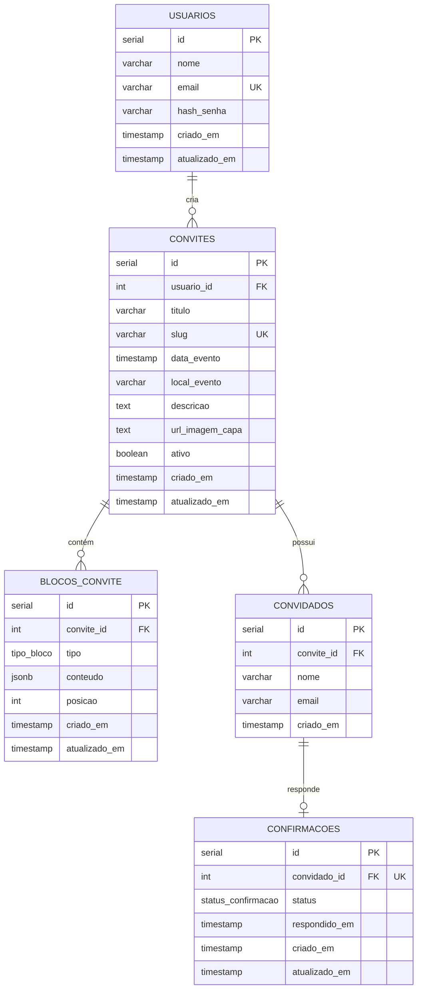

# DER — Diagrama Entidade-Relacionamento

```mermaid
erDiagram
    USUARIOS {
        serial      id            PK
        varchar     nome
        varchar     email         UK
        varchar     hash_senha
        timestamp   criado_em
        timestamp   atualizado_em
    }

    CONVITES {
        serial      id            PK
        int         usuario_id    FK
        varchar     titulo
        varchar     slug          UK
        timestamp   data_evento
        varchar     local_evento
        text        descricao
        text        url_imagem_capa
        boolean     ativo
        timestamp   criado_em
        timestamp   atualizado_em
    }

    BLOCOS_CONVITE {
        serial      id            PK
        int         convite_id    FK
        tipo_bloco  tipo
        jsonb       conteudo
        int         posicao
        timestamp   criado_em
        timestamp   atualizado_em
    }

    CONVIDADOS {
        serial      id            PK
        int         convite_id    FK
        varchar     nome
        varchar     email
        timestamp   criado_em
    }

    CONFIRMACOES {
        serial              id            PK
        int                 convidado_id  FK "UK"
        status_confirmacao  status
        timestamp           respondido_em
        timestamp           criado_em
        timestamp           atualizado_em
    }

    USUARIOS        ||--o{ CONVITES        : "cria"
    CONVITES        ||--o{ BLOCOS_CONVITE  : "contém"
    CONVITES        ||--o{ CONVIDADOS      : "possui"
    CONVIDADOS      ||--o| CONFIRMACOES    : "responde"
```
