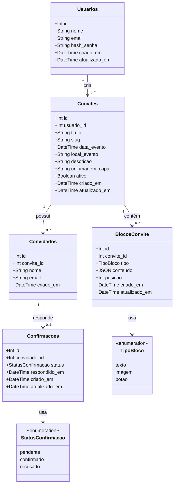

# Diagrama UML — Sistema de Gerenciamento de Convites

```mermaid
classDiagram
    direction TB

    class Usuarios {
        +Int id
        +String nome
        +String email
        +String hash_senha
        +DateTime criado_em
        +DateTime atualizado_em
    }

    class Convites {
        +Int id
        +Int usuario_id
        +String titulo
        +String slug
        +DateTime data_evento
        +String local_evento
        +String descricao
        +String url_imagem_capa
        +Boolean ativo
        +DateTime criado_em
        +DateTime atualizado_em
    }

    class BlocosConvite {
        +Int id
        +Int convite_id
        +TipoBloco tipo
        +JSON conteudo
        +Int posicao
        +DateTime criado_em
        +DateTime atualizado_em
    }

    class Convidados {
        +Int id
        +Int convite_id
        +String nome
        +String email
        +DateTime criado_em
    }

    class Confirmacoes {
        +Int id
        +Int convidado_id
        +StatusConfirmacao status
        +DateTime respondido_em
        +DateTime criado_em
        +DateTime atualizado_em
    }

    class TipoBloco {
        <<enumeration>>
        texto
        imagem
        botao
    }

    class StatusConfirmacao {
        <<enumeration>>
        pendente
        confirmado
        recusado
    }

    Usuarios "1" --> "0..*" Convites : cria
    Convites "1" --> "0..*" BlocosConvite : contém
    Convites "1" --> "0..*" Convidados : possui
    Convidados "1" --> "0..1" Confirmacoes : responde
    BlocosConvite --> TipoBloco : usa
    Confirmacoes --> StatusConfirmacao : usa
```
